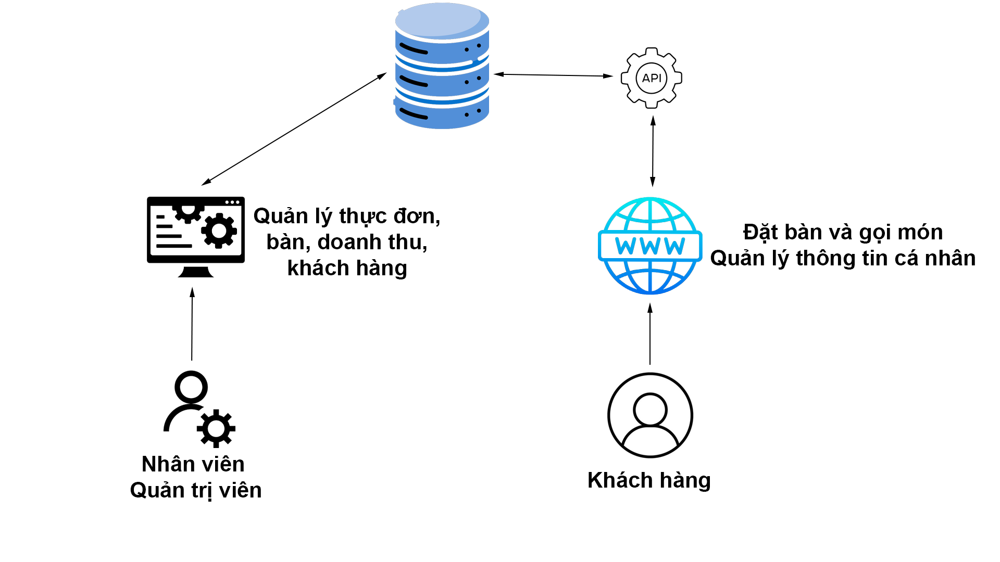

<h3>Thành viên</h3>
<table>
  <tr>
    <th>STT</th>
    <th>Họ tên</th>
    <th>Chức vụ</th>
  </tr>
  <tr>
    <td>1</td>
    <td>Nguyễn Đức Hiền</td>
    <td>Nhóm trưởng</td>
  </tr>
  <tr>
    <td>2</td>
    <td>Huỳnh Quang Khiêm</td>
    <td>Thành viên</td>
  </tr>
</table>

<h3>Sử dụng</h3>
<ul>
  <li>.NET Framework version 4.8</li>
  <li>Visual studio 2022</li>
</ul>

<h3>Chi tiết</h3>

<h3>Dự án</h3>

<h4>Hệ thống quản lý nhà hàng</h4>

<h5>Mô tả dự án</h5>
Xây dựng hệ thống Quản lý Nhà Hàng một cách chuyên nghiệp, linh hoạt, có thể quản lý và lưu trữ được một lượng dữ liệu lớn. Hệ thống giúp người dùng dễ dàng hơn trong việc tổ chức, quản lý dữ liệu Khách hàng, quản lý Đặt bàn, quản lý Thực đơn,… và nhiều hơn thế nữa.
 
<h4>Yêu cầu</h4>
AI: Dự đoán doanh thu  
Web: ASP.Net Core MVC 
Ngôn ngữ: C#  
Framework: Bootstrap  
Nghiệp vụ:  
<table>
  <tr>
    <th>STT</th>
    <th>Nghiệp vụ</th>
    <th>Phân công</th>
  </tr>
  <tr>
    <td>1</td>
    <td>Đăng nhập</td>
    <td>Hiền</td>
  </tr>
  <tr>
    <td>2</td>
    <td>Đăng ký tài khoản</td>
    <td>Hiền</td>
  </tr>
  <tr>
    <td>3</td>
    <td>Đặt bàn và goi món</td>
    <td>Khiêm</td>
  </tr>
  <tr>
    <td>4</td>
    <td>Đổi điểm tích lũy</td>
    <td>Hiền</td>
  </tr>
  <tr>
    <td>5</td>
    <td>Quản lý thông tin cá nhân</td>
    <td>Hiền</td>
  </tr>
  <tr>
    <td>6</td>
    <td>Xem lịch sử hóa đơn</td>
    <td>Khiêm</td>
  </tr>
</table>
 
App: Winform  
Ngôn ngữ: c#  
<table>
  <tr>
    <th>STT</th>
    <th>Nghiệp vụ</th>
    <th>Phân công</th>
  </tr>
  <tr>
    <td>1</td>
    <td>Đăng nhập</td>
    <td>Hiền</td>
  </tr>
  <tr>
    <td>2</td>
    <td>Quản lý Bàn</td>
    <td>Khiêm</td>
  </tr>
  <tr>
    <td>3</td>
    <td>Quản lý Nguyên Liệu</td>
    <td>Khiêm</td>
  </tr>
  <tr>
    <td>4</td>
    <td>Quản lý Kho</td>
    <td>Hiền</td>
  </tr>
  <tr>
    <td>5</td>
    <td>Quản lý Nhập Kho</td>
    <td>Hiền</td>
  </tr>
  <tr>
    <td>6</td>
    <td>Quản lý Thực Đơn</td>
    <td>Khiêm</td>
  </tr>
  <tr>
    <td>7</td>
    <td>Quản lý Nhân Sự</td>
    <td>Khiêm</td>
  </tr>
  <tr>
    <td>8</td>
    <td>Báo cáo Doanh Thu</td>
    <td>Hiền</td>
  </tr>
  <tr>
    <td>9</td>
    <td>Thống kê Hóa Đơn</td>
    <td>Khiêm</td>
  </tr>
   <tr>
    <td>10</td>
    <td>Quản lý khách hàng</td>
    <td>Hiền</td>
  </tr>
</table>
<h3>Chức năng</h3>
<h4>Website</h4>
<h5>Đặt bàn và gọi món</h5>
<ul>
  <li>Khách hàng có thể đặt bàn và xem trạng thái của bàn đã được đặt hay chưa</li>
  <li>Khách hàng có thể đặt món và xem danh sách các món ăn có tại nhà hàng</li>
</ul>
<h5>Đổi điểm tích lũy</h5>
<ul>
  <li>Khi khách hàng thanh toán hóa đơn thì điểm tích lũy sẽ được tích vào tài khoản của khách hàng dùng để đổi voucher</li>
</ul>
<h5>Quản lý thông tin cá nhân</h5>
<ul>
   <li>Xem thông tin cá nhân</li>
  <li>Đặt lại mật khẩu</li>
</ul>
<h5>Xem lịch sử hóa đơn</h5>
<ul>
  <li>Khách hàng có thể xem lại tất cả các hóa đơn đã thanh toán</li>
</ul>
<h4>Winform</h4>
<h5>Quản lý bàn</h5>
<ul>
  <li>Thêm, xóa, sửa bàn</li>
</ul>
<h5>Quản lý nguyên liệu</h5>
<ul>
  <li>Thêm, xóa, sửa nguyên liệu</li>
</ul>
<h5>Quản lý Thực Đơn</h5>
<ul>
  <li>Xem danh sách thực đơn</li>
  <li>Thêm, xóa, sửa thực đơn</li>
</ul>
<h5>Quản lý Thực Đơn</h5>
<ul>
  <li>Xem danh sách thực đơn</li>
  <li>Thêm, xóa, sửa thực đơn</li>
</ul>
<h5>Quản lý Nhân Sự</h5>
<ul>
  <li>Xem thông tin nhân viên</li>
  <li>Thêm, sửa nhân sự</li>
  <li>Phân quyền nhân viên</li>
</ul>
<h5>Báo cáo Doanh Thu</h5>
<ul>
  <li>Xem báo cáo doanh thu từng tháng</li>
</ul>
